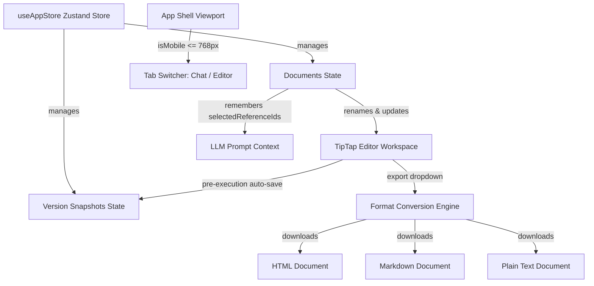

# Feature Design Document — Milestone 4: Polish, History, & Exports

This document specifies the technical design, state architecture, utility engines, and responsive behavior mappings for the Milestone 4 features.

---

## 1. System Overview

Milestone 4 introduces document version control, per-chapter context selection tracking, multi-format exports, and device-responsive controls.



---

## 2. Technical Architectures

### 2.1 Zustand Store Extensions (`src/store/useAppStore.ts`)

To retain selections per chapter and manage version history, we expand the Zutsand store structure:

1. **Chapter Selection State**:
   - `selectedReferenceIds` is tracked globally but synchronized per chapter.
   - The `CanvasDocument` schema includes an optional `selectedReferenceIds` array.
   - When a chapter becomes active, its reference selections are loaded into the store. When reference tags are toggled, they are written to the document item and persisted to `localStorage`.

2. **Document Version Snapshots**:
   - Schema:
     ```typescript
     export interface DocumentVersion {
       id: string
       documentId: string
       timestamp: string
       title: string
       content: string
     }
     ```
   - State variables:
     - `versions: DocumentVersion[]` (globally holds up to 50 snapshots loaded/saved under `web_canvas_versions`).
   - Actions:
     - `createVersionSnapshot(title?: string)`: Captures the active chapter's content and timestamp, inserting a new record at the top of the history list.
     - `restoreVersion(versionId: string)`: Replaces the active chapter's editor content with the snapshot's HTML code. It first takes an automatic snapshot of the pre-restore state, creating an undo point.
     - `deleteVersionSnapshot(versionId: string)`: Removes the snapshot from the list and storage.

---

### 2.2 Format Conversion Engine (`src/utils/convert.ts`)

The export module supports HTML, Markdown, and Plain Text downloads using client-side conversions:

* **HTML to Plain Text**: Utilizes `DOMParser` to extract raw `innerText` with appropriate browser line endings.
* **HTML to Markdown**: Recursively parses DOM nodes into a Markdown syntax string:

| Element | Tag | Markdown Syntax |
|---------|-----|-----------------|
| Header 1 | `<h1>` | `# Text` |
| Header 2 | `<h2>` | `## Text` |
| Paragraph | `<p>` | `Text\n\n` |
| Bold / Strong | `<strong>` / `<b>` | `**Text**` |
| Italic / Emphasis | `<em>` / `<i>` | `*Text*` |
| Blockquote | `<blockquote>` | `> Text\n\n` |
| Code Block | `<pre>` | `\`\`\`\nText\n\`\`\`\n\n` |
| Inline Code | `<code>` | `` `Text` `` |
| Bullet List | `<ul>` | `- Item\n` |
| Numbered List | `<ol>` | `1. Item\n` |
| Hard Break | `<br>` | `\n` |
| Horizontal Rule | `<hr>` | `---\n\n` |

---

### 2.3 Visual Layout & Interaction Designs

#### A. Export Dropdown Panel
Adjacent to the document header's actions, a relative positioning container exposes a floating glassmorphic dropdown:
* Trigger: Clicking the `Download` (or export) button toggles the dropdown overlay.
* Items:
  - **Active Chapter**: Export the current chapter's content as HTML, Markdown, or Plain Text.
  - **All Chapters (Combined)**: Compiles all chapters in outline order (separated by rules or headings) and downloads the consolidated draft as HTML, Markdown, or Plain Text.
* Outside Clicks: A window-level click listener automatically dismisses the dropdown when clicking outside.

#### B. Version History Timeline Drawer
Clicking the `History` (clock icon) button toggles a right-hand sliding panel (`width: 280px`):
* Layout: Uses a slide-in transition animation (`slideInRight` keyframes).
* Content:
  - Header: "Version History" + manual "Save Snapshot" (+ button) + Close (X button).
  - List: Snapshots filtered by the active document ID in reverse chronological order.
  - Snapshot Card: Displays the title (e.g. "Auto-save before rewrite") and timestamp.
  - Hover Action Bar: Displays "Restore" and "Delete" actions clearly.

---

### 2.4 Mobile Responsive Layout Transitions

A media query threshold is set at `768px`. When the window width falls below this limit, the layout undergoes structural shifts:

```css
@media (max-width: 767px) {
  /* 1. App main columns stack vertically */
  .app-main {
    flex-direction: column;
  }
  /* 2. Resize handle is hidden */
  .resize-handle {
    display: none;
  }
  /* 3. Panel views become full-screen width and toggled via tab bar */
  .chat-panel, .canvas-panel {
    width: 100% !important;
    height: calc(100% - 44px);
  }
  /* 4. Sidebar acts as a slide-over overlay panel on top of the content */
  .chapters-sidebar {
    position: absolute;
    left: 0;
    top: 0;
    height: 100%;
    z-index: 40;
  }
}
```

* **Mobile Tab Switcher**:
  Renders a top tab group bar containing `[ Assistant Chat | Document Editor ]` buttons. The layout renders the corresponding view pane while keeping the inactive pane hidden to ensure high performance on mobile devices.
