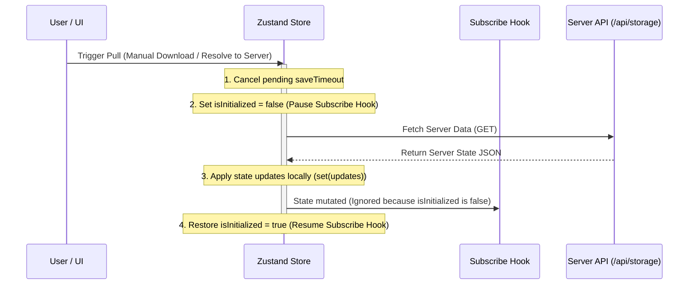

# Safe Storage & Synchronization Architecture

This document describes the synchronization mechanics, storage modes, and transactional safety features implemented in Web Canvas for cross-device consistency and race condition prevention.

---

## 1. Storage Modes

Web Canvas supports two distinct storage locations managed via the `storageMode` configuration:

1. **Browser Local Storage Only (`client`)**:
   - All state modifications (documents, chapters, presets, versions) are persisted exclusively in the browser's `localStorage` cache.
   - Ideal for offline-only, local-first editing. No calls are made to the backend serialization APIs.

2. **Server-Side Storage (`server`)**:
   - Active state is serialized directly to files inside the backend workspace directory (e.g. specified via the `--storage-dir` CLI boot argument).
   - Enables multi-device access, team editing, and cross-session durability.

---

## 2. Synchronization & Auto-Sync Logic

When running in **Server-Side Storage** mode, the synchronization behavior depends on the state of the **Background Auto-Sync** setting (`autoSyncEnabled`):

### Auto-Sync Enabled (`true`)
- **Bidirectional Persistence**: Every local state mutation (manual editing, renaming, importing, settings adjustment) is automatically written to both the browser's `localStorage` and pushed to the backend server.
- **Debounced Save Hook**: State changes trigger a `1000ms` debounced hook in the store subscription listener to batch updates and avoid spamming server API endpoints on every keystroke.

### Auto-Sync Disabled (`false`)
- **Bypass Local Cache**: Changes made during the session do not get persisted to the browser's `localStorage` to avoid stale caching.
- **Bypass Server Hook**: Automatic background writes to `/api/storage` are disabled.
- **Manual Control**: Local changes exist only in-memory during the active session. To persist edits, the user relies on the settings manual sync controls:
  - **Upload to Server**: Manually pushes the current in-memory store state to the server.
  - **Download from Server**: Pulls the server's current state and applies it to the active browser workspace.

---

## 3. Boot Sync Conflict Resolution

On application boot or user login:
1. The client checks session authenticity and fetches the server state via `/api/storage`.
2. If server data exists, it is compared against the browser's local cache using a diffing algorithm (checking Book Titles and Chapter contents/IDs).
3. If an inconsistency is detected, the store holds initialization and triggers the **Sync Conflict Resolution Modal**, offering two choices:
   - **Keep Local State (Upload to Server)**: Uploads the browser cache to the server, aligning the server with the local edits.
   - **Keep Server State (Download to Local)**: Overwrites the local cache with the server files and prompts the user to enable local auto-sync.

---

## 4. Transactional Safety & Concurrency Prevention

To prevent data corruption, race conditions, or redundant loopbacks (e.g., pulling server state, which triggers a local state update, which then triggers a write back to the server), the synchronization engine enforces **Transactional Safety**:

### Safety Rules Applied During Pulls

When resolving conflicts to `'server'` or executing a manual `'Download from Server'` pull:
1. **Autosave Interception**: Any active, pending debounced autosave (`saveTimeout` timer) is instantly cleared and aborted. This ensures that a save scheduled right before a pull doesn't fire after the pull, overwriting new server data with old local data.
2. **Subscription Pausing**: The global `isInitialized` flag is temporarily toggled to `false` before the Zustand state is updated via `set(updates)`. This prevents the subscription listener from treating the pulled state as a new modification, avoiding a redundant loopback save to the server.
3. **Restoration**: The initialization state is restored (`isInitialized = true`) immediately after the local state has been fully reconciled.
