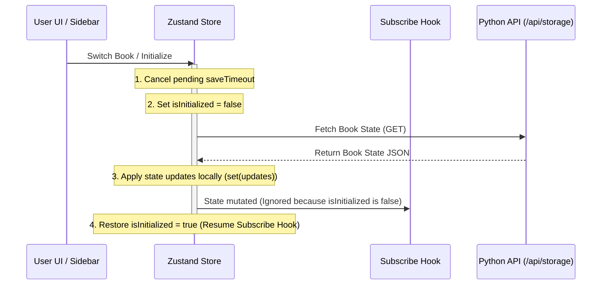

# Server-First Storage & Write-Through Cache Architecture

This document describes the server-first storage architecture, write-through caching mechanisms, and transactional safety features implemented in Web Canvas to ensure durability, low network overhead, and consistent multi-book sessions.

---

## 1. Core Architecture

Web Canvas operates on a **Server-First** paradigm where the backend Python API server acts as the single source of truth for all user data.

1. **Standalone Python Backend Server (`scripts/api_server.py`)**:
   - Manages and stores users and session databases.
   - Saves book data as isolated JSON files in the workspace storage directory.
   - Enforces directory traversal protection and custom session verification.

2. **Write-Through Client-Side Cache (`localStorage`)**:
   - `localStorage` functions strictly as a fast write-through client cache to capture immediate keypress updates.
   - This ensures that sudden browser crashes or page refreshes do not result in data loss, even if the backend is temporarily unreachable.

3. **Debounced Server Synchronization**:
   - Instead of sending network requests on every keystroke, a Zustand store subscriber debounces writes to the server's `/api/storage` endpoint with a `3000ms` window.
   - This batches typing edits, reducing backend load and network congestion.

---

## 2. Boot & Session Lifecycle

The state synchronization flow is clean and predictable:

```
  [ App Start / Login ]
            │
            ▼
┌──────────────────────────────┐
│  Fetch /api/auth/session     │
└───────────┬──────────────────┘
            │
            ├─► Not Logged In ──► Render Auth Form
            │
            ▼ Logged In
┌──────────────────────────────┐
│  Fetch /api/storage          │
│  (for current active book)   │
└───────────┬──────────────────┘
            │
            ├─► Data Found ─────► Apply state to Zustand & local cache
            │
            └─► Server Empty ───► Initialize server file with current state
```

### Book Switching
When a user switches books in the Chapters sidebar:
1. Active debounced autosaves for the previous book are cleared immediately.
2. The client fetches the target book's state from the server.
3. The retrieved JSON content immediately overwrites both the Zustand store and the browser's `localStorage` cache.

---

## 3. Transactional Safety & Loop Prevention

To prevent redundant loopback requests (e.g. state updates triggered by fetching server data triggering another autosave request to the server), the synchronization engine utilizes a transaction lock flag (`isInitialized`):



### Transactional Guard Rules
1. **Autosave Abort**: Before pulling new state from the server, any active debounced autosave timer (`saveTimeout`) is cleared to prevent late execution of old state writes.
2. **Subscription Pausing**: The subscription listener checks the global `isInitialized` variable. While it is `false` during fetch/write operations, all mutations are ignored by the autosave subscriber.
3. **Session Invalidation**: If the server returns a `401 Unauthorized` during a save or fetch (e.g. because another device logged in and invalidated the session), the client clears its local storage cache and redirects to the login screen to protect user privacy.
